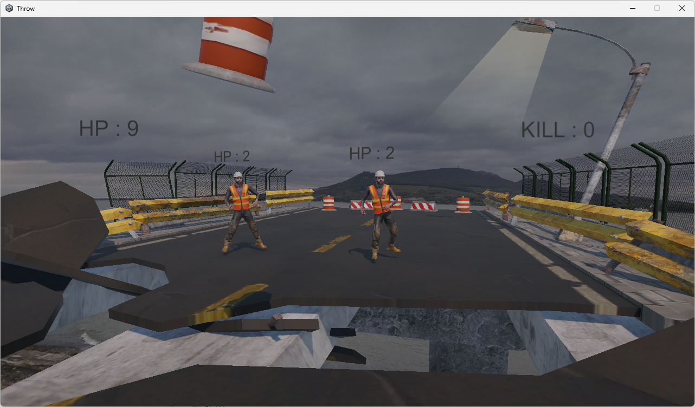

# Throw

## 概要
- ボールを投げて敵を倒し、強化を選びながら生き残るアクションゲームです

## プレイ動画 / スクリーンショット
- 動画: [URL]
- スクリーンショット

  
## 操作方法
- 移動：WASD / 矢印
- 視点：マウス
- 攻撃（投げる）：左クリック
- 回避：Shift
- リスタート：R

## ルール
- このゲームは**クリア条件なし**のサバイバル形式です。敵を倒せるだけ倒してスコア（撃破数）を伸ばします。
- **敵を5体倒すごとにアップグレード**を獲得できます。
- アップグレード内容の例：
  - 移動速度アップ
  - クールタイム短縮
  - 弾数増加
  - ホーミング性能強化
- 時間経過に応じて敵が強くなり、ゲームが徐々に難しくなります。
  - 敵の体力が増加
  - 敵もアップグレードされる
  - 敵のスポーン間隔が短くなる
  - 毎回アップグレードの組み合わせが変わるため、プレイごとに戦い方が変化します。
 
## 工夫した点（アピール）
- **移動を横移動のみに制限**
  - 操作をシンプルにすることで、初見でもゲーム性が分かりやすく、狙う・避けるに集中できるようにしました。

- **プレイヤー強化と敵強化のバランス調整**
  - 「敵を5体倒すごとにアップグレード」を軸にしつつ、敵の体力・強化・スポーン間隔が時間経過で上がるように調整し、難しすぎず簡単すぎない難易度になるようにしました。

- **パトカーギミックによる緊張感の追加**
  - パトカーに敵が当たって倒れても**キルカウントに加算されない**仕様にしました。
  - そのためアップグレード獲得（5キルごと）のためには、パトカーが当たる前に**プレイヤーが敵を倒し切る必要**があり、優先順位や判断が発生して緊張感が生まれるようにしました。

- **敵キャラ・ステージ・背景の統一感**
  - 見た目の方向性を揃えることで、プレイヤーが背景のストーリーを連想できるような世界観を意識しました。

## 苦労した点と解決
- **課題**
  - ChatGPTに提案してもらったコードをそのまま使うと、プロジェクト内で想定通りに動かないことがありました。

- **原因**
  - AIはプロジェクト全体の構成や既存コードの意図を完全には把握できず、その場での一般的な解決策を提示するため、既存実装と齟齬が起きることがありました。

- **対策**
  - コードをそのままコピペするのではなく、処理内容を理解した上で、既存コードの設計やデータ構造に合うように修正して統合しました。

- **学び**
  - 便利なツールでも「動けばOK」で終わらせず、メソッドやクラスなどプログラムの仕組みを理解した上で使うことの重要性を学びました。
  - この経験を通して、仕様を整理しながらデバッグし、修正できる力を身につけました。

## 使用技術
- Unity：6000.2.14f1
- 言語：C#
- 開発環境：Unity Editor / Visual Studio
- 主要機能：[例：CharacterController / Animator / ScriptableObject / UI / Coroutine など]

## 実行方法
### （ビルドがある場合）
- Releases からダウンロードして `Throw.exe` を起動

### （プロジェクトを開く場合）
1. Unity Hub → Add project → このフォルダを選択
2. `Assets/Scenes/Title Scene` を開いて Play

## 今後の改善案
- [改善案1]

## 制作情報
- 制作期間：[例：2週間]
- 制作人数：1人
- 担当：企画 / 実装 / UI / 調整
