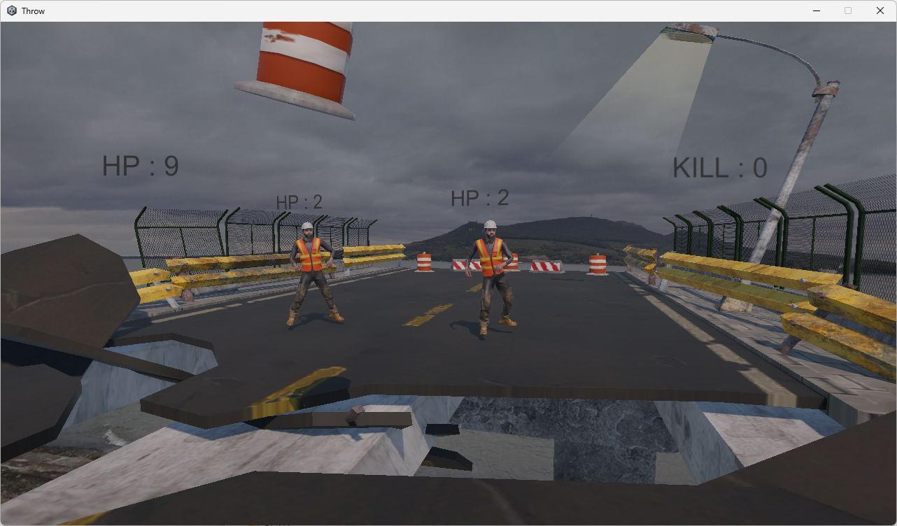

# Throw

## 概要
- ボールを投げて敵を倒し、強化を選びながら生き残るアクションゲームです

## プレイ動画 / スクリーンショット
- 動画: (https://youtu.be/MZYAApskTGo)
- スクリーンショット

  
## 操作方法
- 移動：WASD / 矢印
- 視点：マウス
- 攻撃（投げる）：左クリック
- 回避：Shift
- リスタート：R

## ルール
- このゲームは**クリア条件なし**のサバイバル形式です。敵を倒せるだけ倒してスコア（撃破数）を伸ばします。
- **敵を5体倒すごとにアップグレード**を獲得できます。
- アップグレード内容の例：
  - 移動速度アップ
  - クールタイム短縮
  - 弾数増加
  - ホーミング性能強化
- 時間経過に応じて敵が強くなり、ゲームが徐々に難しくなります。
  - 敵の体力が増加
  - 敵もアップグレードされる
  - 敵のスポーン間隔が短くなる
  - 毎回アップグレードの組み合わせが変わるため、プレイごとに戦い方が変化します。
 
## ゲーム設計
- **移動を横移動のみに制限**
  - 操作をシンプルにすることで、初見でもゲーム性が分かりやすく、狙う・避けるに集中できるようにしました。

- **プレイヤー強化と敵強化のバランス調整**
  - 「敵を5体倒すごとにアップグレード」を軸にしつつ、敵の体力・強化・スポーン間隔が時間経過で上がるように調整し、難しすぎず簡単すぎない難易度になるようにしました。

- **パトカーギミックによる緊張感の追加**
  - パトカーに敵が当たって倒れても**キルカウントに加算されない**仕様にしました。
  - そのためアップグレード獲得（5キルごと）のためには、パトカーが当たる前に**プレイヤーが敵を倒し切る必要**があり、優先順位や判断が発生して緊張感が生まれるようにしました。

- **敵キャラ・ステージ・背景の統一感**
  - 見た目の方向性を揃えることで、プレイヤーが背景のストーリーを連想できるような世界観を意識しました。

## 使用技術
- Unity：6000.2.14f1
- 言語：C#
- 開発環境：Unity Editor / Visual Studio
- 主要機能：[例：CharacterController / Animator / ScriptableObject / UI / Coroutine など]

## 実行方法
### （ビルドがある場合）
- Releases からダウンロードして `Throw.exe` を起動

### （プロジェクトを開く場合）
1. Unity Hub → Add project → このフォルダを選択
2. `Assets/Scenes/Title Scene` を開いて Play

## 今後の改善案
- スタート画面の次に「操作説明画面」を追加し、初見でも遊び方が分かる導線を作る
- 強化時UIを改善し、カードにアイコン（絵）を追加して直感的に効果が伝わるようにする
- 強化内容の説明文を整理し、短く読みやすい文章にする
- リザルト画面を充実させ、プレイ結果（スコア/撃破数/命中率など）を表示して達成感を高める

## 制作情報
- 制作期間：[例：2週間]
- 制作人数：1人
- 担当：企画 / 実装 / UI / 調整
